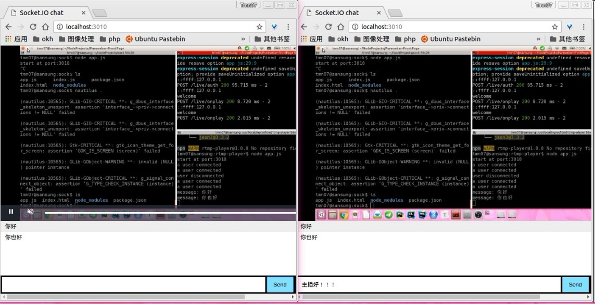

## rtmp播放器

借助video.js&node的socket.io完成，直播播放器与聊天互动。

前端尚丑，日后再改0.0

```shell
# 使用方法
git clone xx-this-repo-xx
npm install 
node app
# 接下来打开浏览器localhost:3010即可
# 关于直播的不谈，，你懂得～
```

```html
<!-- 第一行支持hls，且移动端可行。第二行支持rtmp，移动端无法播放 -->
<source src="../hls/.m3u8" type="application/x-mpegURL">
<source src="rtmp://127.0.0.1:1935/myapp/" type="rtmp/flv"> 
```


### 参考链接

聊天室：http://www.cnblogs.com/yxyblogs/p/5054801.html

hls播放器：https://github.com/huangyaoxin/hLive

google大法秒掉某问题：http://stackoverflow.com/questions/24397379/script-path-for-expressjs-in-node-modules
